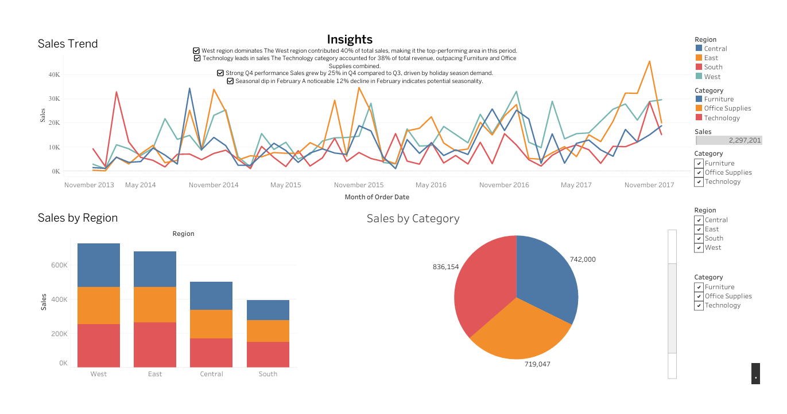

# 📊 Simple Sales Dashboard with Tableau

This project showcases a **sales performance dashboard** built in Tableau. It provides interactive visualizations to analyze sales by region, category, and month.

---

## 🎯 Objective
To create an interactive dashboard that allows users to:
- View **monthly sales trends**.
- Compare **sales across regions**.
- Understand **category-wise contributions** to revenue.

---

## 🛠 Tools Used
- **Tableau Desktop**: For dashboard creation and visualization.  
- *(Optional)* **Python + Pandas**: For data preprocessing (if required).  

---

## 📁 Dataset
- **Superstore_Sales.csv**  
  *(Columns: Order Date, Region, Category, Sales, Profit)*  

---

## 📊 Features
- **Line Chart**: Sales over time (Month-Year).  
- **Bar Chart**: Total sales by region.  
- **Donut Chart**: Sales distribution by category.  
- **Filters**: Explore data by Region and Category.  

---

## 📄 Deliverables
- 📈 **Dashboard Screenshot/PDF**: Visual summary of sales performance.  
- 📝 **Key Insights Document**:  
  - West region leads sales with 40% share.  
  - Technology category dominates revenue.  
  - Seasonal trends observed in February and Q4.

---

## 📌 Author
**Kevin Lazarus**  
*M.Sc. Data Science /*
*Bishop Heber College*/

---

## 📥 How to View
1. Download `Simple Sales Dashboard.twbx`.  
2. Open in Tableau Desktop or Tableau Public.  
3. Interact with filters to explore insights.  

---

## 📸 Sample Dashboard

